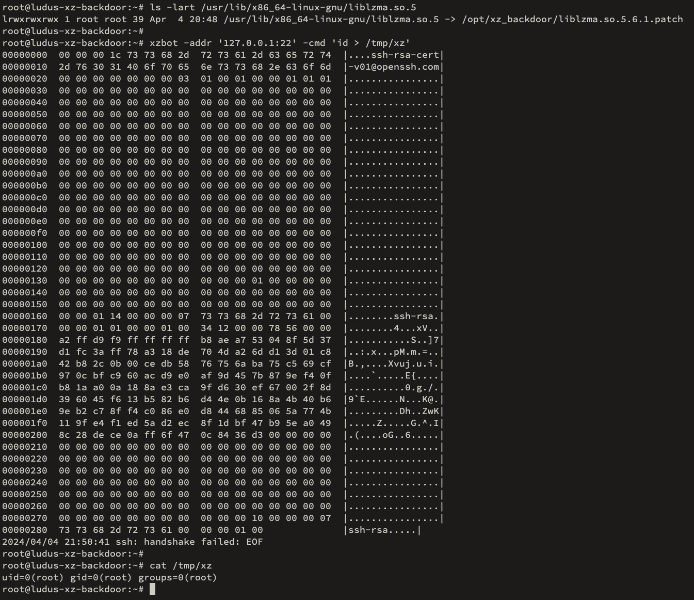

# Ansible Role: xz backdoor (CVE-2024-3094) (for [Ludus](https://ludus.cloud))

An Ansible Role that installs the [xz backdoor (CVE-2024-3094)](https://www.openwall.com/lists/oss-security/2024/03/29/4) on a Debian host and optionally installs the [xzbot](https://github.com/amlweems/xzbot) tool.

> [!WARNING]
> This role deploys malware on purpose!
> Without exposing the host to the internet you *should* be safe, but it's still malware. Be careful.



## Requirements

Debian based OS

## Role Variables

Available variables are listed below, along with default values (see `defaults/main.yml`):

    # Install the xzbot cli tool used to send commands to the backdoor. It is installed to /usr/bin/xzbot
    ludus_xz_backdoor_install_xzbot: true
    # Install the xz backdoor library by linking it to liblzma.so.5 used by the system and rebooting
    ludus_xz_backdoor_install_backdoor: true
    # Remove the backdoor by replacing the symlink to liblzma.so.5 with the original and rebooting
    ludus_xz_backdoor_uninstall_backdoor: false

## Dependencies

None.

## Example Playbook

```yaml
- hosts: xz_backdoor_hosts
  roles:
    - badsectorlabs.ludus_xz_backdoor
  vars:
    ludus_xz_backdoor_install_xzbot: true
    ludus_xz_backdoor_install_backdoor: true
```

## Example Ludus Range Config

```yaml
ludus:
  - vm_name: "{{ range_id }}-xz-backdoor"
    hostname: "{{ range_id }}-xz-backdoor"
    template: debian-12-x64-server-template
    vlan: 10
    ip_last_octet: 2
    ram_gb: 2
    cpus: 2
    linux: true
    roles:
      - badsectorlabs.ludus_xz_backdoor
    role_vars:
      ludus_xz_backdoor_install_xzbot: true
      ludus_xz_backdoor_install_backdoor: true
```

## License

GPLv3

## Author Information

This role was created by [Bad Sector Labs](https://github.com/badsectorlabs), for [Ludus](https://ludus.cloud/).
